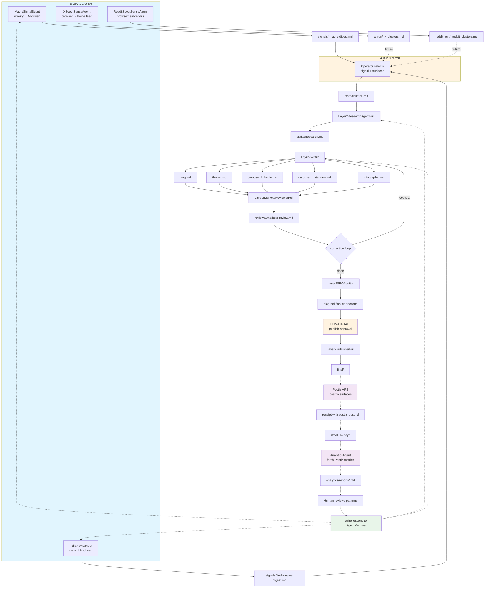

# Merged Harness Workflow Diagram

## Legend

- **Blue boxes**: Signal scouts
- **Orange boxes**: Human gates
- **Purple boxes**: Future Postiz + analytics layer
- **Green box**: Learning / memory
- **Dotted lines**: Future integrations not built yet
